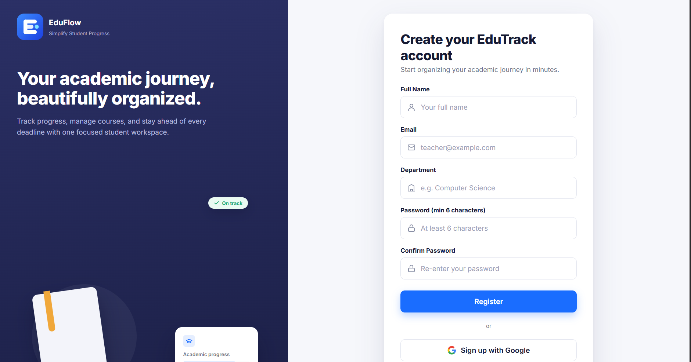
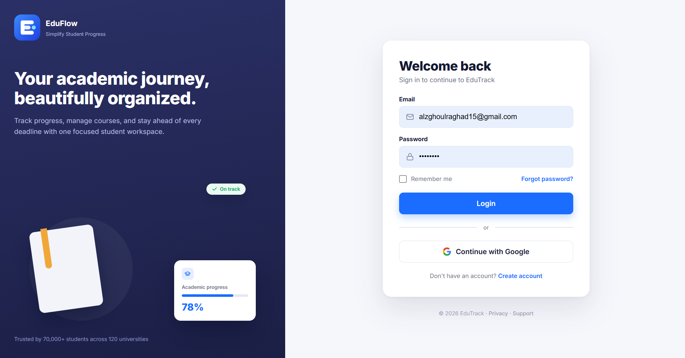
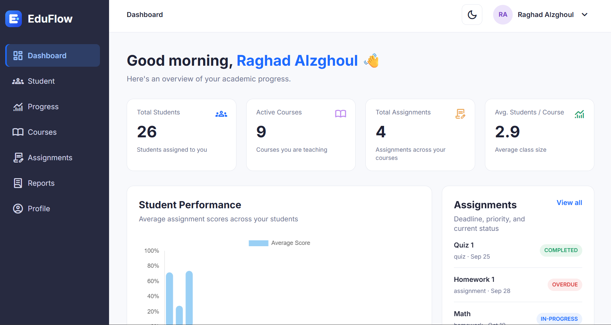
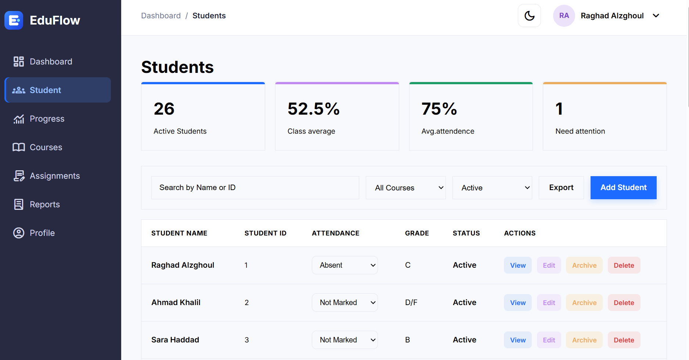
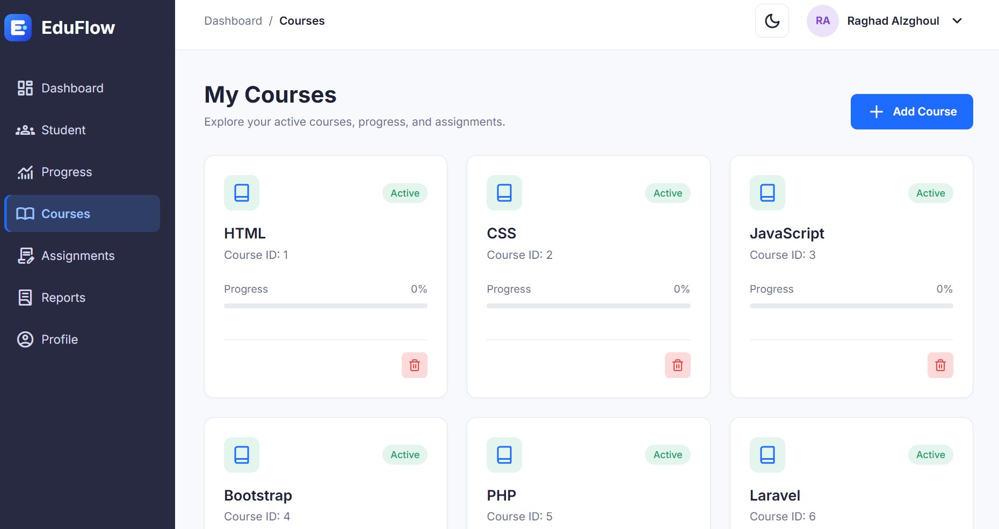
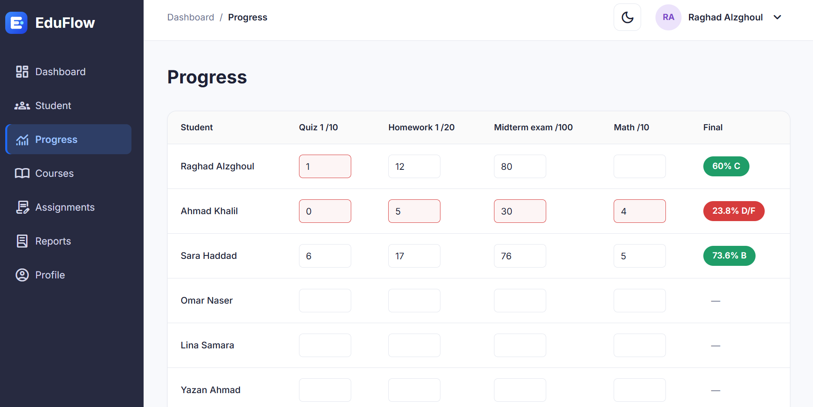
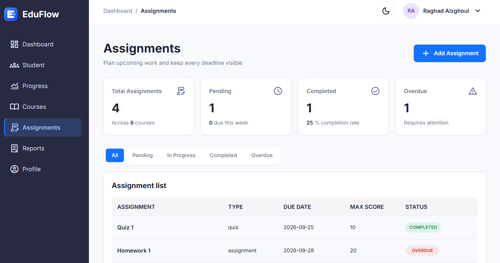
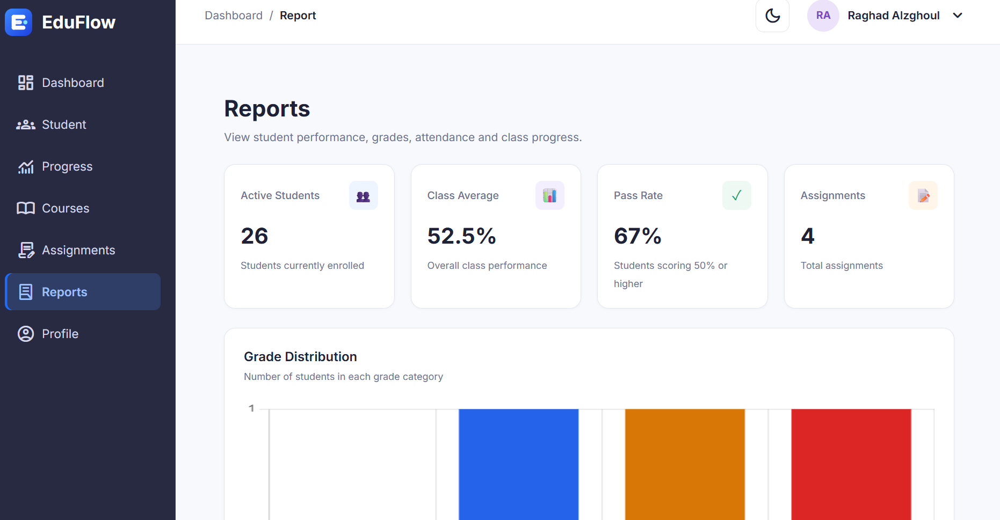
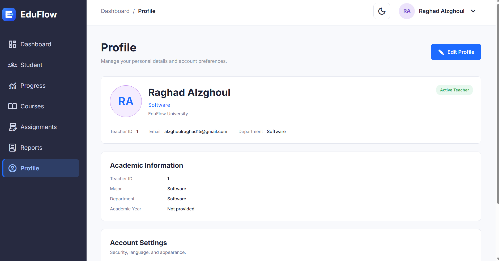

# EduFlow 🎓
**Simplify Student Progress**

EduFlow is a web-based student progress management system. We built this platform to give teachers and administrators a clean, centralized place to manage students, track courses, handle assignments, and generate performance reports without the usual headache.

## ✨ What You Can Do
* **Dashboard:** Get a quick overview of stats, active students, and overall progress at a glance.
* **Student Management:** Add new students, search, filter, and view detailed academic records.
* **Courses & Assignments:** Browse available courses, connect them to students, and track assignment completion.
* **Progress & Reports:** Monitor grades, check attendance, and generate clear academic performance reports.
* **Secure Access:** Fully functional authentication system (Login/Signup/Logout) with protected pages.
* **Work Anywhere:** A fully responsive interface that looks great on Desktop, Tablet, and Mobile.

## 💻 Built With
* **Design & Prototyping:** [Figma UI Mockup](https://www.figma.com/design/i3witCvEgKX9swob9VtQRB/Untitled?node-id=56-1717&t=iHfAZBemhe4IwYMP-0)
* **Frontend:** HTML5, CSS3, JavaScript (Vanilla)
* **Data & Storage:** REST API (MockAPI) & Local Storage
* **Version Control:** Git & GitHub

## 🚀 How to Run It Locally
You don't need any complex backend environment to test this out. Just follow these steps:

1. **Clone the repository:**
    ```bash
    git clone https://github.com/ZaidAlqaryouti2002/EduFlow.git
    ```
2. **Open the project folder:**
    ```bash
    cd EduFlow
    ```
3. **Run the app:**
    * Open the project in Visual Studio Code and use the **Live Server** extension.
    * Or, simply open the `pages/Login.html` file directly in your web browser.

> **Note:** EduFlow uses MockAPI to fetch and save data in real-time. Make sure you have an active internet connection when using the application.

## 📂 Project Structure
A quick look at how we organized our code:
```text
EduFlow/
├── assets/          # Static assets & icons
├── js/              # Core logic (api, auth, courses, progress, etc.)
├── pages/           # HTML views (Login, Dashboard, Students, etc.)
├── Screenshots/     # UI preview captures
├── style/           # Stylesheets (layout.css, courses.css, etc.)
└── README.md        # Documentation
```

## 📸 Screenshots
Here is a look at what we've built:










## 🤝 The Team
This project was developed collaboratively by our team:
* **Scrum Master:** Zaid Alabed
* **Product Owner:** Raghad Alzghoul
* **Development Team:** 
  * Besan Nazzal
  * Mousa Joudeh
  * Hamza Obaidat
